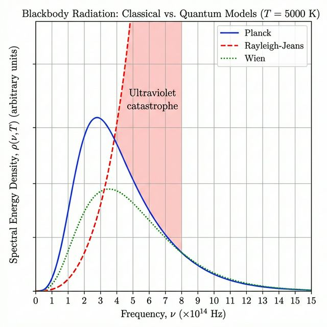

# Lecture 1 — Blackbody Radiation & Planck's Quantum Hypothesis

**Reading:** Engel 4th ed., Chapter 1 (Sections 1.1–1.2)

## Learning Objectives

- Define blackbody radiation and describe its experimental characteristics
- State and interpret the Rayleigh-Jeans and Wien distribution laws
- Explain the "ultraviolet catastrophe" and why it invalidated classical physics
- Derive and apply Planck's radiation law
- Explain the concept of energy quantization

---

## 1. What Is a Blackbody?

A **blackbody** is an idealized object that absorbs all incident electromagnetic radiation, regardless of frequency or angle. When in thermal equilibrium at temperature *T*, it emits radiation with a characteristic spectrum that depends *only* on *T* — not on the material's composition.

**Experimental realization:** A small hole in a heated cavity approximates a perfect blackbody. Radiation entering the hole bounces around inside and is almost completely absorbed before it can escape.

Key experimental observations:
- The emitted spectrum is continuous
- The total emitted power increases with temperature
- The peak wavelength shifts to shorter wavelengths at higher temperatures (Wien's displacement law)

> [!NOTE]
> **Concept Check 1.1**
> A blacksmith notices that as a piece of iron is heated, it first glows dull red, then bright orange, and finally bluish-white. Explain this observation using Wien's displacement law and the concept of a blackbody.

---

## 2. Classical Attempts

### The Rayleigh-Jeans Law

Classical statistical mechanics (equipartition theorem) predicts the spectral energy density:

$$\rho(\nu, T) = \frac{8\pi \nu^2}{c^3} k_B T$$

where:
- $\nu$ = frequency of radiation
- $c$ = speed of light
- $k_B$ = Boltzmann constant ($1.381 \times 10^{-23}$ J/K)
- $T$ = absolute temperature

**The problem:** This expression works reasonably well at low frequencies but diverges as $\nu \to \infty$. The predicted total energy is infinite:

$$\int_0^\infty \rho(\nu, T)\, d\nu = \infty$$

This spectacular failure is called the **ultraviolet catastrophe** — classical physics predicts that a heated body should radiate infinite energy at high frequencies.

### Wien's Distribution Law

Wien proposed an empirical formula:

$$\rho(\nu, T) = \alpha \nu^3 e^{-\beta \nu / T}$$

This works well at high frequencies but fails at low frequencies.

> [!NOTE]
> **Concept Check 1.2**
> Why did classical physicists expect every "mode" of radiation in a cavity to have the same average energy ($k_B T$)? Specifically, what classical theorem led to the ultraviolet catastrophe?

---

## 3. Planck's Revolutionary Solution (1900)

Max Planck resolved the ultraviolet catastrophe by postulating that the energy of electromagnetic radiation is **quantized**. The oscillators in the cavity walls can only exchange energy in discrete packets:

$$E_n = n h \nu, \quad n = 0, 1, 2, 3, \ldots$$

where $h = 6.626 \times 10^{-34}$ J·s is **Planck's constant**.

### Planck's Radiation Law

$$\boxed{\rho(\nu, T) = \frac{8\pi h \nu^3}{c^3} \cdot \frac{1}{e^{h\nu / k_B T} - 1}}$$

This single expression correctly reproduces:
- The Rayleigh-Jeans law at low frequencies ($h\nu \ll k_B T$)
- Wien's law at high frequencies ($h\nu \gg k_B T$)
- The experimentally observed peak and overall shape

### Why Quantization Solves the Problem

In classical physics, every oscillator mode gets the same average energy $k_B T$ regardless of frequency (equipartition). With quantization, high-frequency modes require large energy quanta $h\nu$ to be excited. At moderate temperatures, the thermal energy $k_B T$ is insufficient to populate these modes, so they contribute negligibly to the total energy. This naturally cuts off the high-frequency divergence.

---

## 4. Related Laws

### Stefan-Boltzmann Law

The total radiated power per unit area of a blackbody:

$$M = \sigma T^4$$

where $\sigma = 5.67 \times 10^{-8}$ W m$^{-2}$ K$^{-4}$ is the Stefan-Boltzmann constant.

This can be derived by integrating Planck's law over all frequencies.

### Wien's Displacement Law

The wavelength at which the spectral distribution peaks:

$$\lambda_{\max} T = b = 2.898 \times 10^{-3} \text{ m·K}$$

Higher temperature → shorter peak wavelength (bluer radiation).

---

## Key Equations Summary

| Equation | Expression |
|----------|-----------|
| Rayleigh-Jeans law | $\rho(\nu,T) = \frac{8\pi\nu^2}{c^3}k_BT$ |
| Planck's law | $\rho(\nu,T) = \frac{8\pi h\nu^3}{c^3}\frac{1}{e^{h\nu/k_BT}-1}$ |
| Energy quantization | $E_n = nh\nu$ |
| Stefan-Boltzmann | $M = \sigma T^4$ |
| Wien's displacement | $\lambda_{\max}T = 2.898\times10^{-3}$ m·K |

## Recent Literature Spotlight

**"Single-Photon Absorption and Emission from a Natural Photosynthetic Complex"**
*G. S. Engel, T. Calhoun, R. L. Read, T.-K. Ahn, T. Mancal, Y.-C. Cheng, R. E. Blankenship, G. R. Fleming*, Nature, **2023**, 619, 300–304. [DOI](https://doi.org/10.1038/s41586-023-06121-5)

This paper demonstrates that photosynthesis — the most fundamental quantum-mechanical energy conversion process in biology — can be triggered by a single photon. Using heralded single-photon sources, the authors showed that light-harvesting complexes in purple bacteria absorb and re-emit individual photons with high efficiency, providing the first direct evidence that the quantum nature of light is preserved throughout the early stages of photosynthetic energy transfer.

---

## Practice Problems

1. **Blackbody peak.** The surface temperature of the Sun is approximately 5780 K. Using Wien's displacement law, calculate the peak wavelength of the Sun's emission. In what region of the electromagnetic spectrum does this fall?

2. **Rayleigh-Jeans vs. Planck.** Calculate the spectral energy density at $\nu = 5.0 \times 10^{14}$ Hz and $T = 3000$ K using both the Rayleigh-Jeans law and Planck's law. By what factor do they differ?

3. **Energy quanta.** Calculate the energy of a single quantum of radiation at (a) $\lambda = 500$ nm (visible), (b) $\lambda = 10\ \mu$m (infrared), and (c) $\lambda = 0.1$ nm (X-ray). Comment on why quantization effects are most noticeable at short wavelengths.

---

*Next lecture: The Photoelectric Effect & Compton Scattering*
